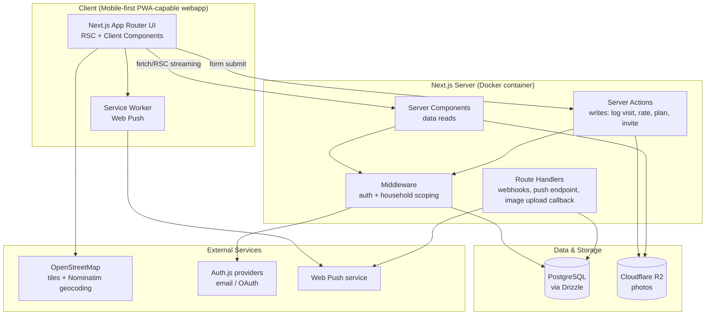

# High-Level Design (HLD)
## "Our Table" — Next.js Implementation

**Companion to:** Restaurant_Tracker_PRD.md
**Scope:** Architecture, tech stack, module structure, data layer, API surface, and cross-cutting concerns needed to start building.

---

## 1. Tech Stack

| Layer | Choice | Why |
|---|---|---|
| Framework | **Next.js 15 (App Router)**, TypeScript | Server Components fit a mostly-read, list-heavy app (Explore/Map/Lists); Server Actions cover writes (log visit, rate, plan) without a separate API layer for most flows. |
| Styling / UI | **Tailwind CSS + shadcn/ui** | Fast to build mobile-first, accessible components (NFR-10); matches the clean card/list aesthetic in the mockups. |
| Database | **PostgreSQL** (self-hosted, official `postgres` Docker image) | Relational model (§3 of PRD) is genuinely relational — joins across Restaurant/Visit/VisitRating/Tag need real foreign keys, not a document store. |
| ORM | **Drizzle** | Type-safe queries matching the entities 1:1, lightweight SQL-first migrations, good Next.js/edge support. |
| Auth | **Auth.js (NextAuth v5)** — email magic link + optional Google OAuth | Two-person households, no complex roles; magic link is the lowest-friction "invite your partner" flow. |
| Household invites | Custom `HouseholdInvite` token table + Auth.js callback | Not a stock feature of any auth library — small, explicit implementation. |
| Validation | **Zod**, shared between Server Actions and forms (via `react-hook-form` + `@hookform/resolvers/zod`) | Same schema validates client input and server action payload — avoids drift. |
| Photo storage | **Cloudflare R2** (S3-compatible object storage) | Simple signed-upload flow from a Next.js Server Action; no egress fees, thumbnails generated on read via an image transform (e.g. Cloudflare Images or `next/image` with a custom loader). |
| Maps | **Leaflet.js + OpenStreetMap tiles** (map rendering) + **Nominatim** (OSM geocoding/address search) | Free and open-source end to end — no API key, no billing, no usage cap tied to a card on file. Trade-off: address-autocomplete quality and tile styling are rougher than Mapbox/Google (see §8). |
| Client data fetching | **React Server Components** for initial loads; **TanStack Query** for client-side re-fetching/optimistic updates (e.g. rating submission, list toggling) | RSC minimizes client JS for read-heavy screens; Query handles the interactive bits cleanly. |
| Client state | Local `useState`/`useReducer` for forms and filters; **Zustand** only if cross-component UI state (e.g. Map filter chips shared with a bottom sheet) gets unwieldy | Avoid over-engineering — most state is server state, not client state. |
| Notifications | **Web Push** (via a service worker) for "partner hasn't rated yet"; fallback to in-app badge/count if push permission denied | Matches NFR-7 without needing a third-party notification service for v1. |
| Hosting | **Docker Compose stack, self-hosted** — Next.js app container + PostgreSQL container, on your own host/VPS + **Cloudflare R2** (photos) | Runs locally/on infra you control instead of a managed PaaS; no vendor lock-in on app hosting or the database. |

---

## 2. High-Level Architecture



**Key architectural decisions:**
- **No separate backend service.** Next.js Server Actions + Route Handlers are the entire backend for v1 — one deployable, one repo, matches the team size and scope.
- **Middleware enforces household scoping.** Every authenticated request resolves `session.user.householdId` once in middleware and every Drizzle query is filtered by it — this is the main defense against cross-household data leaks (NFR-6), not something left to each query author to remember.
- **Server Actions over a REST/GraphQL API** for internal app writes, since there's no separate mobile-native client in v1 — Route Handlers are reserved for things that genuinely need an HTTP endpoint (push subscription registration, R2 upload callbacks, any future public webhook).

---

## 3. Route / Module Structure (App Router)

```
app/
├── (auth)/
│   ├── sign-in/page.tsx
│   ├── join/[inviteToken]/page.tsx        # accept household invite
│   └── layout.tsx
│
├── (app)/                                  # authenticated shell, has bottom nav
│   ├── layout.tsx                          # bottom nav: Home / Explore / Map / Calendar / Lists / Profile
│   ├── page.tsx                            # Home Dashboard
│   ├── explore/
│   │   ├── page.tsx                        # cuisine/location/top-rated browse
│   │   └── search/page.tsx
│   ├── map/page.tsx
│   ├── calendar/page.tsx                   # Calendar/Timeline (new screen)
│   ├── lists/
│   │   ├── page.tsx                        # My Lists / Smart Lists toggle
│   │   └── [listId]/page.tsx
│   ├── restaurants/
│   │   ├── new/page.tsx                    # Add Restaurant
│   │   └── [restaurantId]/
│   │       ├── page.tsx                    # Overview tab
│   │       ├── visits/page.tsx
│   │       ├── menu/page.tsx
│   │       ├── photos/page.tsx
│   │       ├── reviews/page.tsx            # side-by-side
│   │       └── info/page.tsx
│   ├── visits/
│   │   ├── new/page.tsx                    # Add a Visit / Plan a Visit form
│   │   └── [visitId]/
│   │       ├── page.tsx                    # Visit Detail
│   │       ├── items/page.tsx              # Ordered Items
│   │       └── rate/page.tsx               # Your Review form
│   └── profile/
│       ├── page.tsx
│       └── household/page.tsx              # invite partner, manage members
│
├── api/
│   ├── auth/[...nextauth]/route.ts
│   ├── push/subscribe/route.ts
│   ├── uploads/photo/route.ts              # signed R2 upload
│   └── cron/complete-planned-visits/route.ts   # called by the scheduler container; flips planned→completed after 24h
│
└── layout.tsx                              # root layout, PWA manifest, theme

worker/
└── scheduler.ts                            # node-cron process, runs as its own docker-compose service,
                                             # hits api/cron/complete-planned-visits on a schedule

lib/
├── db.ts                                   # Drizzle client singleton
├── auth.ts                                 # Auth.js config
├── household.ts                            # getCurrentHousehold(), scoping helpers
├── validations/                            # Zod schemas (shared client+server)
│   ├── restaurant.ts
│   ├── visit.ts
│   ├── rating.ts
│   └── list.ts
├── actions/                                # Server Actions, grouped by domain
│   ├── restaurant-actions.ts
│   ├── visit-actions.ts
│   ├── rating-actions.ts
│   ├── list-actions.ts
│   └── household-actions.ts
└── smart-lists.ts                          # smart-list rule → Drizzle query mapping (§3.2 PRD)

db/
├── schema.ts
└── migrations/

components/
├── ui/                                     # shadcn primitives
├── restaurant/                             # RestaurantCard, RestaurantHeader, TagChips
├── visit/                                  # VisitTimelineRow, VisitForm, OrderedItemRow
├── rating/                                 # RatingStars, CategoryRatingBar, CompareRatings
├── calendar/                               # MonthGrid, TimelineList
├── map/                                    # MapView, MapPinCard
└── layout/                                 # BottomNav, TopBar
```

---

## 4. Data Layer

Drizzle schema (`db/schema.ts`, `pg-core`) is a direct translation of PRD §3, with a few implementation-level additions:

```ts
import {
  pgTable, pgEnum, text, timestamp, boolean, integer, numeric,
  jsonb, uniqueIndex, index, primaryKey,
} from "drizzle-orm/pg-core";
import { createId } from "@paralleldrive/cuid2";

// ---- Enums ----
export const priceRangeEnum = pgEnum("price_range", ["LOW", "MID", "HIGH", "LUXE"]); // $ / $$ / $$$ / $$$$
export const restaurantStatusEnum = pgEnum("restaurant_status", ["WISHLIST", "VISITED", "PLANNED"]);
export const opinionTagEnum = pgEnum("opinion_tag", ["FAVORITE", "LIKE_IT", "SOK", "HAVENT_TRIED", "DISLIKE"]);
export const tagCategoryEnum = pgEnum("tag_category", ["VIBE", "FOOD_TYPE", "METHOD"]);
export const mealEnum = pgEnum("meal", ["BREAKFAST", "LUNCH", "DINNER"]);
export const dineTypeEnum = pgEnum("dine_type", ["DINE_IN", "DELIVERY", "TAKEOUT"]);
export const visitStatusEnum = pgEnum("visit_status", ["PLANNED", "COMPLETED"]);
export const paymentSplitEnum = pgEnum("payment_split", ["EQUAL", "INDIVIDUAL", "ONE_PAID"]);
export const wouldReturnEnum = pgEnum("would_return", ["YES", "MAYBE", "NO"]);
export const listTypeEnum = pgEnum("list_type", ["MANUAL", "SMART"]);

// ---- Tables ----
export const households = pgTable("households", {
  id: text("id").primaryKey().$defaultFn(() => createId()),
  name: text("name").notNull(),
  createdAt: timestamp("created_at").defaultNow().notNull(),
});

export const users = pgTable("users", {
  id: text("id").primaryKey().$defaultFn(() => createId()),
  householdId: text("household_id").notNull().references(() => households.id),
  displayName: text("display_name").notNull(),
  email: text("email").notNull().unique(),
  avatarUrl: text("avatar_url"),
  color: text("color"),
});

export const householdInvites = pgTable("household_invites", {
  id: text("id").primaryKey().$defaultFn(() => createId()),
  householdId: text("household_id").notNull().references(() => households.id),
  token: text("token").notNull().unique(),
  expiresAt: timestamp("expires_at").notNull(),
  createdAt: timestamp("created_at").defaultNow().notNull(),
});

export const restaurants = pgTable("restaurants", {
  id: text("id").primaryKey().$defaultFn(() => createId()),
  householdId: text("household_id").notNull().references(() => households.id),
  name: text("name").notNull(),
  priceRange: priceRangeEnum("price_range"),
  website: text("website"),
  phone: text("phone"),
  address: text("address"),
  lat: numeric("lat"),
  lng: numeric("lng"),
  neighborhood: text("neighborhood"),
  area: text("area"),
  supportsDelivery: boolean("supports_delivery").default(false).notNull(),
  supportsDineIn: boolean("supports_dine_in").default(false).notNull(),
  supportsTakeout: boolean("supports_takeout").default(false).notNull(),
  menuUrl: text("menu_url"),
  status: restaurantStatusEnum("status").default("WISHLIST").notNull(),
  notes: text("notes"),
  createdAt: timestamp("created_at").defaultNow().notNull(),
}, (t) => ({
  householdIdx: index("restaurants_household_idx").on(t.householdId),
}));

// lightweight "Dusk/Kjatar"-style gut tag, no visit required
export const restaurantOpinions = pgTable("restaurant_opinions", {
  id: text("id").primaryKey().$defaultFn(() => createId()),
  restaurantId: text("restaurant_id").notNull().references(() => restaurants.id),
  userId: text("user_id").notNull().references(() => users.id),
  tag: opinionTagEnum("tag").notNull(),
  updatedAt: timestamp("updated_at").defaultNow().notNull(),
}, (t) => ({
  uniqueRestaurantUser: uniqueIndex("opinion_restaurant_user_idx").on(t.restaurantId, t.userId),
}));

export const tags = pgTable("tags", {
  id: text("id").primaryKey().$defaultFn(() => createId()),
  householdId: text("household_id").notNull().references(() => households.id),
  name: text("name").notNull(),
  category: tagCategoryEnum("category").notNull(),
}, (t) => ({
  uniqueHouseholdNameCategory: uniqueIndex("tag_household_name_category_idx").on(t.householdId, t.name, t.category),
}));

export const restaurantTags = pgTable("restaurant_tags", {
  restaurantId: text("restaurant_id").notNull().references(() => restaurants.id),
  tagId: text("tag_id").notNull().references(() => tags.id),
}, (t) => ({
  pk: primaryKey({ columns: [t.restaurantId, t.tagId] }),
}));

export const visits = pgTable("visits", {
  id: text("id").primaryKey().$defaultFn(() => createId()),
  restaurantId: text("restaurant_id").notNull().references(() => restaurants.id),
  householdId: text("household_id").notNull().references(() => households.id),
  visitDate: timestamp("visit_date").notNull(),
  visitTime: text("visit_time"),
  meal: mealEnum("meal"),
  dineType: dineTypeEnum("dine_type"),
  occasion: text("occasion"),
  partySize: integer("party_size"),
  status: visitStatusEnum("status").default("COMPLETED").notNull(), // PLANNED | COMPLETED
  seating: text("seating"),
  subtotal: numeric("subtotal"),
  tip: numeric("tip"),
  totalPaid: numeric("total_paid"),
  paymentSplit: paymentSplitEnum("payment_split"),
  paymentMethod: text("payment_method"),
  createdById: text("created_by_id").notNull().references(() => users.id),
  createdAt: timestamp("created_at").defaultNow().notNull(),
}, (t) => ({
  householdDateIdx: index("visits_household_date_idx").on(t.householdId, t.visitDate),
  restaurantIdx: index("visits_restaurant_idx").on(t.restaurantId),
}));

export const orderedItems = pgTable("ordered_items", {
  id: text("id").primaryKey().$defaultFn(() => createId()),
  visitId: text("visit_id").notNull().references(() => visits.id),
  dishName: text("dish_name").notNull(),
  price: numeric("price"),
  shared: boolean("shared").default(true).notNull(),
  orderedById: text("ordered_by_id"),
  wouldOrderAgain: boolean("would_order_again"),
});

export const visitRatings = pgTable("visit_ratings", {
  id: text("id").primaryKey().$defaultFn(() => createId()),
  visitId: text("visit_id").notNull().references(() => visits.id),
  userId: text("user_id").notNull().references(() => users.id),
  overallRating: numeric("overall_rating").notNull(),
  food: integer("food"),
  service: integer("service"),
  atmosphere: integer("atmosphere"),
  value: integer("value"),
  drinks: integer("drinks"),
  presentation: integer("presentation"),
  waitingTime: integer("waiting_time"),
  cleanliness: integer("cleanliness"),
  wouldReturn: wouldReturnEnum("would_return"),
  favoriteDishId: text("favorite_dish_id"),
  reviewText: text("review_text"),
}, (t) => ({
  uniqueVisitUser: uniqueIndex("rating_visit_user_idx").on(t.visitId, t.userId),
}));

export const photos = pgTable("photos", {
  id: text("id").primaryKey().$defaultFn(() => createId()),
  visitId: text("visit_id").references(() => visits.id),
  restaurantId: text("restaurant_id").references(() => restaurants.id),
  url: text("url").notNull(),
  uploadedById: text("uploaded_by_id").notNull().references(() => users.id),
  createdAt: timestamp("created_at").defaultNow().notNull(),
});

export const lists = pgTable("lists", {
  id: text("id").primaryKey().$defaultFn(() => createId()),
  householdId: text("household_id").notNull().references(() => households.id),
  name: text("name").notNull(),
  type: listTypeEnum("type").notNull(), // MANUAL | SMART
  smartRule: jsonb("smart_rule"),
  icon: text("icon"),
});

export const listItems = pgTable("list_items", {
  listId: text("list_id").notNull().references(() => lists.id),
  restaurantId: text("restaurant_id").notNull().references(() => restaurants.id),
}, (t) => ({
  pk: primaryKey({ columns: [t.listId, t.restaurantId] }),
}));
```

Relations (for Drizzle's relational query API — `db.query.restaurants.findMany({ with: {...} })`) are defined separately via `relations()` calls in the same file, mirroring the foreign keys above (e.g. `restaurant.household`, `restaurant.tags` through `restaurantTags`, `visit.ratings`, etc.) — omitted here for brevity but follow Drizzle's standard one-to-many/many-to-many pattern.

**Derived fields** (`averageRating`, `visitCount`, `lastVisitDate`, `averageBill`) are **not stored** — computed via Drizzle aggregate queries (`avg()`, `count()`, `max()` from `drizzle-orm`) or a materialized view later if performance requires it at scale (NFR-1).

---

## 5. Server Actions ↔ Functional Requirements Map

| Server Action | FR | Notes |
|---|---|---|
| `createRestaurant` / `updateRestaurant` | FR-1.1–1.5 | Fuzzy duplicate check via `pg_trgm` similarity query on name+address before insert. |
| `setRestaurantOpinion` | FR-1.4 | Upserts `RestaurantOpinion` on `(restaurantId, userId)`. |
| `createVisit` (mode: `logged` or `planned`) | FR-2.1, FR-4.1 | Same action, `status` param determines `PLANNED` vs `COMPLETED`. |
| `updateVisit` / `rescheduleVisit` / `cancelVisit` | FR-2.5, FR-4.3 | Cancel = delete if `PLANNED`; logged visits are edited, not deleted, to preserve rating history. |
| `addOrderedItem` / `updateOrderedItem` / `removeOrderedItem` | FR-2.2 | |
| `submitVisitRating` / `updateVisitRating` | FR-3.1–3.2 | Upsert on `(visitId, userId)`; triggers push notification action to partner on first submit (FR-3.4). |
| `attachPhoto` | FR-2.4 | Receives R2 object URL after client-side signed upload completes. |
| `createList` / `renameList` / `deleteList` / `toggleListItem` | FR-5.2–5.3 | Smart lists are read-only computed queries, no action needed to "create" them — they're seeded once per household on creation. |
| `createHouseholdInvite` / `acceptHouseholdInvite` | FR-6.1–6.2 | Invite token expires in 7 days; acceptance links the new `User` to the existing `Household`. |
| `completePlannedVisit` | FR-4.4 | Also triggered by the `worker` scheduler service (`node-cron`, running as its own container) hitting `api/cron/complete-planned-visits` for the 24h auto-transition. |

Read paths (Explore, Map, Calendar, Lists, Restaurant Detail) are implemented as **Server Components fetching directly via Drizzle** — no Server Action needed since there's no client-side mutation involved, just server-rendered data.

---

## 6. Cross-Cutting Concerns

### 6.1 Auth & Household Scoping
- `middleware.ts` runs on every `(app)/*` route: verifies session, attaches `householdId` to request context.
- A single `lib/household.ts` helper (`requireHousehold()`) is the **only** sanctioned way to get `householdId` in a Server Component/Action — code review checklist item: no raw `session.user` household lookups elsewhere.
- Every Drizzle query in `lib/actions/*` and page data-fetchers includes a `.where(eq(table.householdId, householdId))` clause — enforced by convention now, could be upgraded to Postgres Row-Level Security later if this becomes multi-tenant at scale.

### 6.2 Offline Support (NFR-2)
- Visit-logging forms (`visits/new`, `visits/[id]/rate`) persist form state to `localStorage`/IndexedDB on every change (via a small `useDraftPersist` hook), independent of network state.
- On submit, if offline, the Server Action call is queued (via a simple background-sync-capable service worker) and retried on reconnect; UI shows a "will sync" indicator rather than blocking.
- This is the one part of the app that benefits from being a lightweight PWA — `manifest.json` + service worker registered in root layout.

### 6.3 Notifications (NFR-7)
- On `submitVisitRating` success, if the visit doesn't yet have a rating from the partner, enqueue a Web Push notification ("Sam rated Lyla — add your rating").
- Push subscription registered client-side, stored via `api/push/subscribe`, keyed by `userId`.
- Fallback: an in-app badge count on the bottom nav (Home icon) computed from a simple query (visits missing the current user's rating) — works even if push permission was denied.

### 6.4 Smart Lists Implementation
- `lib/smart-lists.ts` defines each built-in rule (Top Rated, Hidden Gems, Most Visited, Date Night Spots, To Revisit, Not Visited in 1+ Year) as a typed function `(householdId) => Drizzle query`, not stored `smartRule` JSON for the built-ins (keeps them type-safe and easy to tune). The `smartRule` JSON column on `lists` is reserved for a possible future "custom smart list builder" — out of scope for v1 UI but the schema doesn't block it.

### 6.5 Calendar/Timeline
- `calendar/page.tsx` fetches all `Visit`s in the visible month range (`visitDate` between start/end) in one query, grouped client-side by day for the month-grid, or rendered flat for the timeline toggle — same data, two presentations, no separate endpoint.

### 6.6 Image Handling
- Client requests a signed upload URL from `api/uploads/photo`, uploads directly to Cloudflare R2 (bypasses the Next.js server for the file bytes), then calls `attachPhoto` Server Action with the resulting object URL.
- Thumbnails via Next.js `<Image>` with a custom loader pointed at a Cloudflare Images (or Workers-based resize) transform — no separate thumbnail-generation job needed.

---

## 7. Deployment & Environments

Everything runs as a **Docker Compose stack**, self-hosted (no managed PaaS for the app or database):

```yaml
# docker-compose.yml (shape, not final)
services:
  app:        # Next.js app, built via a multi-stage Dockerfile, runs `next start`
  db:         # postgres:16, named volume for data persistence
  worker:     # node-cron scheduler (see §3 folder structure), hits the app's cron route on schedule
```

| Env | Purpose | Notes |
|---|---|---|
| `local` | Dev | `docker compose up` runs `app` + `db` + `worker` together; `app` container mounts source with hot reload for development. |
| `staging` | Pre-prod verification | Same Compose stack deployed to a staging host/VPS, separate `db` volume and `.env` from production. |
| `production` | Live | Same Compose stack deployed to the production host/VPS; `db` on a persistent volume with scheduled backups (e.g. `pg_dump` cron job or volume snapshots); Cloudflare R2 remains external object storage for photos. |

**Migrations:** `drizzle-kit migrate` run as a one-off step (e.g. a Compose `run` command or an init container) before `app` starts on each deploy, against the `db` service.

**CI:** Drizzle Kit migration check (`drizzle-kit check`) + typecheck + lint on every PR, plus a build of the `app` Docker image to catch Dockerfile/build issues early; image is pushed to a registry and pulled on the target host for staging/production deploys.


---

## 8. Open Technical Decisions
1. **Nominatim usage policy** — the public Nominatim endpoint is free but rate-limited (1 req/sec, no bulk/heavy use) and its ToS asks for attribution + a real User-Agent; fine for a 2-person household's occasional "Add Restaurant" lookups, but if usage grows, self-hosting a Nominatim instance (still free, just infra to run) or switching to a paid geocoder becomes worth revisiting. Needs a decision before Add-Restaurant flow is built.
2. **PWA depth** — is "installable app icon + offline draft saving" enough, or do we want full offline read access (cached restaurant/visit data via a local IndexedDB mirror)? Affects NFR-2 scope significantly.
3. **Push vs simpler polling** — Web Push requires HTTPS + service worker complexity; an in-app badge alone (no push) might be sufficient for a 2-person household that already opens the app daily. Worth validating before building the push pipeline.
4. **Smart-list thresholds** — "Hidden Gems" (`visit_count ≤ 2`) and "Not Visited in 1+ Year" (365 days) are hard-coded guesses from the mockups; confirm actual thresholds before finalizing `lib/smart-lists.ts`.
