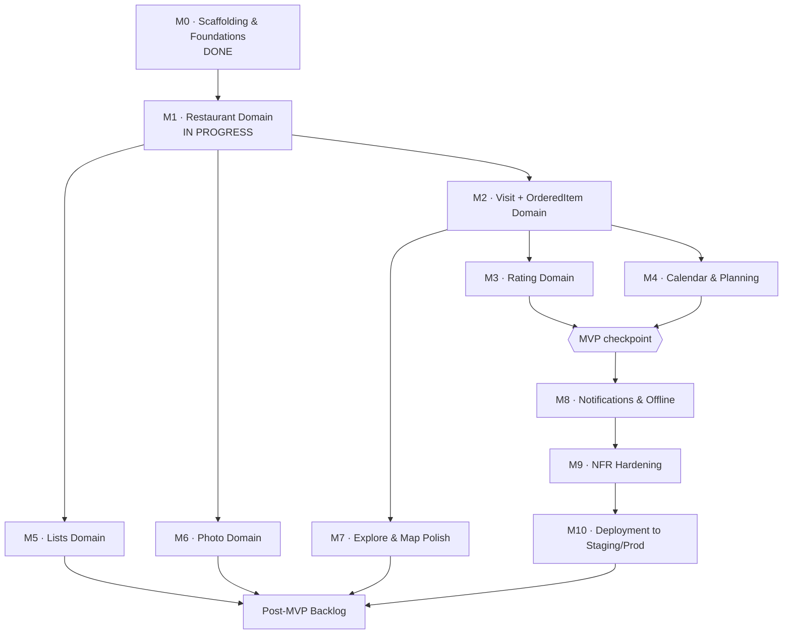

# Development Roadmap — "Our Table"

**Companion to:** PRD, HLD, LLD, Scaffolding Prompt, Restaurant Domain Prompt
**Purpose:** Sequence the remaining work into milestones, show what depends on what, and call out the earliest point where the app is actually useful to dogfood.

No calendar dates here — relative sizing (S/M/L) instead, since velocity depends on how much time you're putting in. Reorder if a size estimate turns out wrong; the dependency graph is the part that shouldn't move.

---

## 1. Dependency Graph

**Read this as:** Restaurant unlocks everything (it's the FK root). Visit unlocks Rating and Calendar. Rating is the last piece needed for the app to deliver its core promise — once M3 and M4 are both done, you have something worth actually using daily, even though Lists/Photos/Map/Notifications aren't built yet.

---

## 2. Milestones

### M0 — Scaffolding & Foundations · **DONE**
Docker Compose stack, Drizzle schema, Auth.js + household creation/invite (basic), route shells, folder structure. *(If the household invite flow from LLD §10 isn't fully working yet — i.e. you and your partner can't both actually sign in to the same household — that's worth closing out before M1, since everything after this assumes two real users.)*

---

### M1 — Restaurant Domain · **IN PROGRESS**
- Scope: LLD §2 in full (schemas, queries, actions, tests), per the domain prompt already in motion.
- **Exit criteria:** both of you can add a restaurant, see it in a basic list, edit it, and the duplicate-detection / archive-on-delete logic is tested and working.
- Size: **M**

### M2 — Visit + OrderedItem Domain
- Scope: LLD §3 and §4. Build these together — ordered items only ever exist inside a visit, so splitting them into separate milestones adds overhead without adding safety.
- Start with `status="COMPLETED"` visits only (i.e. logging something that already happened); defer `PLANNED` status handling to M4 even though the schema supports it now — keeps this milestone focused on the "log a visit" loop (PRD Flow A, steps 1–3) without also building the calendar UI in the same pass.
- **Exit criteria:** Add a Visit form works end-to-end (restaurant → date/meal/occasion → ordered items → bill), Visit Detail page shows it back, `listVisitsForRestaurant` and `getVisitDetail` are tested and household-scoped.
- Size: **M**

### M3 — Rating Domain
- Scope: LLD §5. `submitVisitRating` (upsert), partner-missing-rating detection, `getRestaurantRatingComparison`.
- Notification: build the **in-app badge fallback first** (a simple "visits missing your rating" count on Home, per `listVisitsMissingMyRating` in LLD §3.3) — this alone closes the loop for two people who open the app daily. Push notifications are real infrastructure (service worker, subscription storage) — defer to M8 rather than gold-plating this milestone.
- **Exit criteria:** Rating form works, Reviews (Side by Side) screen shows both partners' scores for a restaurant, badge shows up when a rating is pending.
- Size: **M**

**→ At the end of M3 + M4, you've hit the MVP checkpoint** (see §3).

### M4 — Calendar & Planning
- Scope: LLD §3's `PLANNED` status path — `createVisit(status: "PLANNED")`, `rescheduleVisit`, `cancelVisit`, `completeVisit`, plus the `worker` cron job (LLD §9.4) that auto-transitions after 24h.
- Build the Calendar/Timeline UI (month grid + list toggle, per HLD §6.5) — this is the one net-new screen not in the original mockups.
- **Exit criteria:** Can plan a future visit, see it on Home and Calendar, reschedule/cancel it, and confirm it flips to `COMPLETED` (manually or via the cron job) with the rate/log-items flow then unlocking.
- Size: **M**, mostly because of the cron/worker plumbing — the CRUD itself reuses M2's patterns.

### M5 — Lists Domain
- Scope: LLD §7 — manual lists (create/rename/delete/toggle item) and the 6 built-in smart lists (`lib/smart-lists.ts`, thresholds resolved in LLD §6).
- This is a good milestone to do **after** M2/M3 exist, since several smart lists (Top Rated, Hidden Gems, Not Visited in 1+ Year) are meaningless until there's real visit/rating data to compute against — building it earlier means staring at empty lists.
- **Exit criteria:** Lists screen (My Lists / Smart Lists toggle) works, smart lists return correct results against your actual logged data.
- Size: **S–M**

### M6 — Photo Domain
- Scope: LLD §8 — signed R2 upload Route Handler, `attachPhoto`/`removePhoto` actions, thumbnail display in Visit Detail and Restaurant Detail.
- **Exit criteria:** Can attach a photo to a visit from the phone camera roll, see thumbnails in the timeline, R2 cleanup job (orphaned objects) is running in `worker`.
- Size: **S–M**

### M7 — Explore & Map Polish
- Scope: full Explore filter/sort UI (cuisine, location, top-rated, nearby), Leaflet + OpenStreetMap map view, Nominatim address autocomplete wired into the Add Restaurant form (M1 can ship with a plain text address field first — this milestone is where geocoding actually gets connected).
- **Exit criteria:** Explore and Map screens match the mockups functionally; new restaurants get lat/lng from address autocomplete instead of manual entry.
- Size: **M**, bounded mostly by Nominatim's 1 req/sec rate limit (LLD/HLD open item) — worth a debounce on the autocomplete input from day one here.

### M8 — Notifications & Offline
- Scope: real Web Push (service worker, subscribe/unsubscribe Route Handlers from LLD §9.2, triggering on rating submission), plus the offline-draft-persistence behavior for the visit-logging form (NFR-2 — save to IndexedDB/localStorage while offline, sync on reconnect).
- **Exit criteria:** Push notification actually arrives on a partner's phone when the other rates a visit; logging a visit with no signal doesn't lose data.
- Size: **M–L** — service workers and offline sync are the fiddliest infra in the whole project; budget more time here than the LOC would suggest.

### M9 — NFR Hardening
- Scope: sweep the PRD's NFR table against reality — accessibility pass on ratings/tags (NFR-10, don't rely on color alone), a performance check on the computed-field queries (`averageRating` etc.) once there's enough data to matter (NFR-1), confirm `createdBy`/`uploadedBy` auditability is actually surfaced somewhere in the UI (NFR-11), stub the rate-limiting flagged in LLD §12.3 if Nominatim/search usage warrants it by now.
- Size: **S**

### M10 — Deployment to Staging/Production
- Scope: stand up the `staging` and `production` Docker Compose environments (HLD §7) on real infra, set up scheduled `pg_dump` backups for the `db` volume, confirm the migration step runs cleanly as part of deploy.
- **Exit criteria:** You and your partner are using the production instance for real, on your own phones, off your own infra.
- Size: **S–M**, depends entirely on how much Docker/VPS ops experience you're starting from.

---

## 3. MVP Checkpoint

**The MVP is M0 → M3 → M4.** At that point:
- Both of you can add restaurants, log visits (including bill/ordered items), and rate them independently
- You can see each other's ratings side by side
- You can plan future visits and see them on a calendar

**Deliberately not required for MVP:** Lists (M5), Photos (M6), Map/geocoding polish (M7), real push notifications (M8). All of these are genuinely nice, none of them are the thing that makes the app "the shared restaurant tracker" instead of "a shared spreadsheet" — that's the rating comparison and visit history, which land in M3/M2.

If you want to start actually using the app daily sooner than "all 10 milestones done," **M4 is the natural pause point to start dogfooding** while M5–M10 continue in the background.

---

## 4. Suggested Working Rhythm

Given the domain-by-domain discipline already established (schema → queries → actions → tests → UI, per the Restaurant Domain Prompt):
- Treat each milestone above as 1 "prompt" of that same shape — I can draft the Visit-domain version of that prompt next, then Rating, and so on, each one pointing at the right LLD section.
- After each milestone's tests pass, it's worth a manual pass of actually using that feature with your partner before starting the next milestone — this is a 2-person app, so "does it feel right when we both use it" is a real acceptance test the LLD can't fully specify.

---

## 5. Post-MVP Backlog (explicitly out of scope until the above is done)
Pulled forward from PRD §9 and HLD §8, for reference — don't start on these early:
- Group households of 3+ members
- Custom smart-list builder (the `smartRule` JSON column already reserves space for this)
- Reservation booking integrations (OpenTable/Resy)
- Public sharing / social feed
- Real-time "partner is viewing this too" presence indicators
